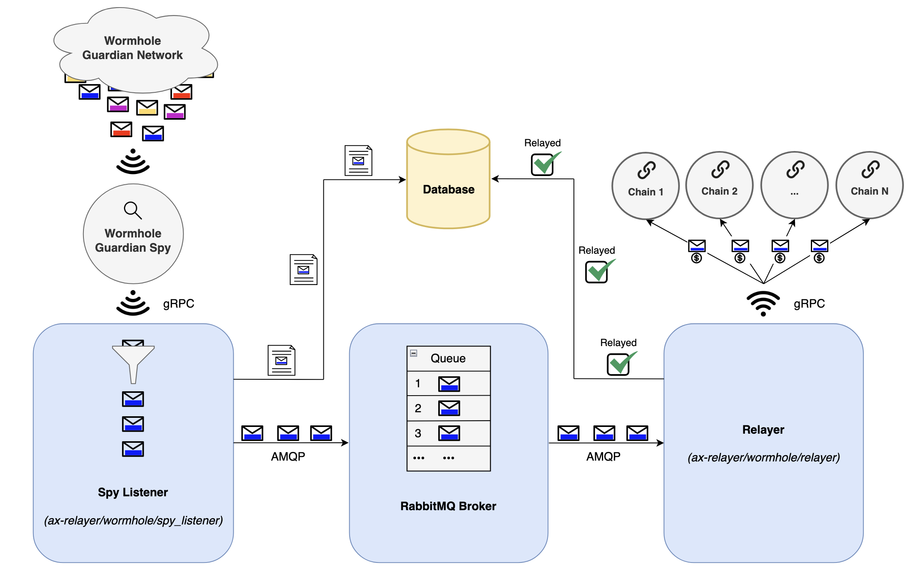

# Wormhole Relayer

Ax Protocol's Python adaptation of Wormhole's [spy_relayer](https://github.com/wormhole-foundation/wormhole/tree/main/relayer/spy_relayer).

There are two main components to this service, the Spy Listener and the Relayer. However, these components interact with other services to properly handle their job. Please refer to the image below for more details.

## 

## <p align="center">Figure 1: Process Flow Diagram</p>

## Spy Listener

Listens for VAAs (messages) in Wormhole's Guardian Network via gRPC subscription to Wormhole's Guardian Spy. This Spy Listener implementation specifically listens for VAAs relevant to Ax Protocol. When a relevant VAA in the Guardian Network is received, the Spy Listener publishes the message to an [AMQP queue](https://rabbitmq.com/) for the Relayer to pick up.

## Relayer

Receives messages from the [AMQP queue](https://rabbitmq.com/), delivers the messages, and pays the corresponding gas fees at the destination chain.

## Guardian Spy

In order for the Spy Listener to receive a stream of relevant VAAs from the Guardian Network, it must connect to a running Guardian Spy. Below is a command to run a Mainnet Guardian Spy locally from a docker container.

```sh
docker run \
    --platform=linux/amd64 \
    -p 7073:7073 \
    --entrypoint /guardiand \
    ghcr.io/wormhole-foundation/guardiand:latest \
spy --nodeKey /node.key --spyRPC "[::]:7073" --network /wormhole/mainnet/2 --bootstrap /dns4/wormhole-mainnet-v2-bootstrap.certus.one/udp/8999/quic/p2p/12D3KooWQp644DK27fd3d4Km3jr7gHiuJJ5ZGmy8hH4py7fP4FP7
```
